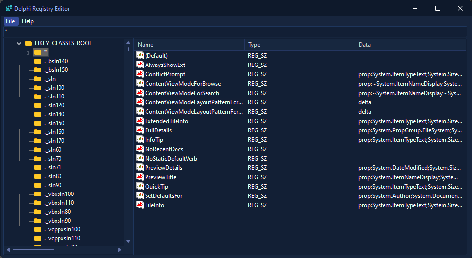

# 🔧 Delphi Windows Registry Editor

A powerful and user-friendly Windows Registry Editor built with Delphi, providing a graphical interface for safely viewing and modifying the Windows Registry.



## ✨ Features

- 🌳 **Hierarchical Tree View**: Easy navigation through registry keys using a familiar tree structure
- 📝 **Value Editor**: View and modify different types of registry values
  - String values (REG_SZ)
  - Binary data (REG_BINARY)
  - DWORD values (REG_DWORD)
  - Multi-string values (REG_MULTI_SZ)
- 💾 **Import/Export**: Support for importing and exporting registry files (.reg)
- 🔐 **Safe Access**: Read-only access by default with proper permission handling
- 🔍 **Real-time Updates**: Immediate reflection of changes in the registry
- 📊 **Value Type Support**: Clear indication of different value types with appropriate icons

## 🚀 Getting Started

### Prerequisites

- Delphi RAD Studio (tested with recent versions)
- Windows Operating System
- Administrative privileges for registry modifications

### Installation

1. Clone the repository:
```bash
git clone https://github.com/yourusername/delphi-registry-editor.git
```

2. Open the project in Delphi RAD Studio
3. Compile and build the application
4. Run the executable with administrative privileges

## 💻 Usage

1. **Browsing the Registry**
   - Use the tree view on the left to navigate through registry keys
   - View values in the list view on the right

2. **Modifying Values**
   - Right-click on a value to modify, rename, or delete it
   - Use the binary editor for REG_BINARY values

3. **Import/Export**
   - Use File -> Export to save registry keys to .reg files
   - Use File -> Import to restore registry keys from .reg files

4. **Safety Features**
   - Confirmation dialogs for dangerous operations
   - Read-only access by default
   - Error handling for access violations

## ⚠️ Important Notes

- Always backup your registry before making modifications
- Use with caution as incorrect registry modifications can cause system instability
- Some operations require administrative privileges
- Created for educational and professional use

## 🛠️ Technical Details

Built using:
- Delphi VCL Framework
- Windows Registry API
- Native Windows controls
- Custom component implementations

Key components:
- TRegistry class for registry access
- TTreeView for hierarchy display
- TListView for value display
- Custom value editors

## 🤝 Contributing

Contributions are welcome! Feel free to make a pull request ect... ect...

## 📜 License

This project is provided "as is" without warranty. Use at your own risk.

## 👨‍💻 Author

Created by BitmasterXor

## 📞 Contact

- Discord: bitmasterxor

---
<p align="center">Made with ❤️ using Delphi RAD Studio</p>
